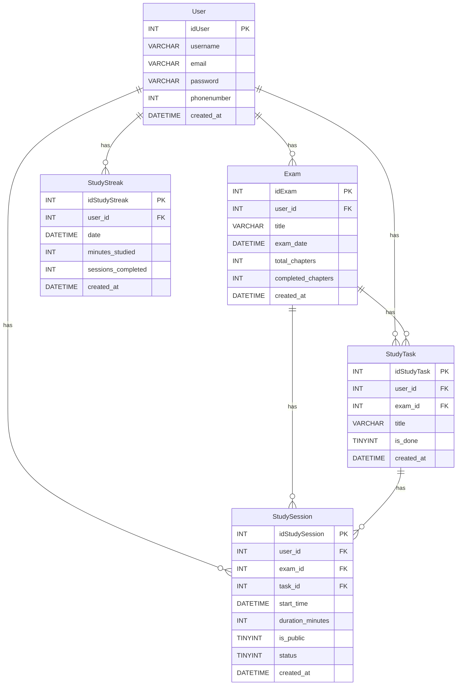

# StudySync 📚

An intelligent study planning and time management web application that helps students overcome procrastination through adaptive "Panic Mode" alerts and integrated Pomodoro timer.

## 🎯 Project Overview

StudySync is a Django-based web application designed to help students stay on track with their academic goals. Unlike traditional study trackers, StudySync actively monitors your progress and alerts you when you're falling behind schedule, creating urgency and accountability.

## ✨ Key Features

- **Intelligent Panic Mode**: Real-time calculation of study requirements with visual alerts (Green/Yellow/Red)
- **Adaptive Dashboard**: Changes appearance based on your study status
- **Pomodoro Timer**: Integrated 25-minute focus sessions with distraction logging
- **Smart Task Management**: Automatic prioritization of overdue and urgent tasks
- **Progress Tracking**: Visual charts showing study hours, streaks, and completion rates
- **Exam Countdown**: Days remaining with calculated daily study requirements
- **AJAX Integration**: Real-time updates without page refreshes

## 🛠️ Technologies Used

- **Backend**: Django 4.x, Python 3.x
- **Database**: MySQL
- **Frontend**: HTML5, CSS3, Bootstrap 5, JavaScript
- **AJAX**: jQuery for dynamic content updates
- **Deployment**: AWS EC2
- **Version Control**: Git & GitHub

## 📋 Project Requirements

This project fulfills the following requirements:
- ✅ Django application with 5 pages
- ✅ User authentication (login/registration)
- ✅ Responsive design (Bootstrap)
- ✅ AJAX for dynamic updates
- ✅ RESTful API endpoints
- ✅ MySQL database
- ✅ Form validation & security (CSRF, SQL injection protection)
- ✅ AWS deployment

## 📄 Pages

1. **Login/Registration** - Secure user authentication
2. **Dashboard** - Adaptive interface with panic mode alerts
3. **Subjects & Exams** - Manage subjects, exams, and tasks
4. **Study Sessions** - Pomodoro timer with session history
5. **About Us** - Project information

## 🗄️ Database Schema



## 🚀 Installation & Setup

### Prerequisites:
- Python 3.8+
- MySQL 8.0+
- pip
- virtualenv

### Steps:

1. **Clone the repository**
```bash
git clone https://github.com/YOUR_USERNAME/studysync-django.git
cd studysync-django
```

2. **Create virtual environment**
```bash
python -m venv venv
source venv/bin/activate  # On Windows: venv\Scripts\activate
```

3. **Install dependencies**
```bash
pip install -r requirements.txt
```

4. **Configure database**
Create a MySQL database and update `settings.py`:
```python
DATABASES = {
    'default': {
        'ENGINE': 'django.db.backends.mysql',
        'NAME': 'studysync_db',
        'USER': 'your_mysql_user',
        'PASSWORD': 'your_mysql_password',
        'HOST': 'localhost',
        'PORT': '3306',
    }
}
```

5. **Run migrations**
```bash
python manage.py makemigrations
python manage.py migrate
```

6. **Create superuser**
```bash
python manage.py createsuperuser
```

7. **Run development server**
```bash
python manage.py runserver
```

Visit: `http://127.0.0.1:8000/`

## 🔌 API Endpoints

| Method | Endpoint | Description |
|--------|----------|-------------|
| GET | `/api/dashboard/` | Get today's stats and alerts |
| GET | `/api/subjects/` | List all subjects with status |
| POST | `/api/session/start/` | Start a study session |
| POST | `/api/session/complete/` | Complete a session |
| POST | `/api/tasks/toggle/` | Toggle task completion |

## 🔒 Security Features

- Password hashing with Django's built-in system
- CSRF token protection on all forms
- Input validation to prevent SQL injection
- XSS protection for user-generated content
- Session security with timeout mechanisms

## 📱 Responsive Design

StudySync is fully responsive and works seamlessly on:
- 📱 Mobile devices (320px+)
- 📱 Tablets (768px+)
- 💻 Desktops (1024px+)

## 👨‍💻 Author

**Your Name**
- GitHub: [https://github.com/nourbatniji]
- Project Trello:

## 📅 Project Timeline

- **Start Date**: November 15, 2025
- **Presentation Date**: November 26, 2025
- **Duration**: 11 days


## 🙏 Acknowledgments

- Django Documentation
- Bootstrap Framework
- MySQL Community
- Stack Overflow Community

---

**Note**: This project was developed as part of a solo project assignment demonstrating Django, MySQL, AJAX, API development, and AWS deployment skills.

