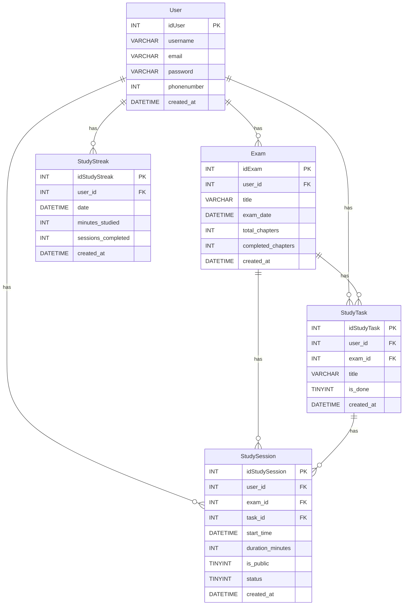

# StudySync

A Django-based study planning app that helps students stay on track with adaptive "Panic Mode" alerts and a built-in Pomodoro timer.

## Features

- Panic Mode alerts (Green/Yellow/Red) based on real-time progress
- Pomodoro timer with session tracking
- Exam countdown with daily study requirement calculator
- Task management with automatic prioritization
- Progress charts for study hours and streaks

## Tech Stack

- Backend: Django 4.x, Python 3.x
- Database: MySQL
- Frontend: HTML5, CSS3, Bootstrap 5, jQuery
- Deployment: AWS EC2

## Database Schema



## Setup

1. Clone the repo and create a virtual environment
```bash
git clone https://github.com/nourbatniji/StudySync.git
cd StudySync
python -m venv venv
source venv/bin/activate
```

2. Install dependencies
```bash
pip install -r requirements.txt
```

3. Configure MySQL in `settings.py`
```python
DATABASES = {
    'default': {
        'ENGINE': 'django.db.backends.mysql',
        'NAME': 'studysync_db',
        'USER': 'your_user',
        'PASSWORD': 'your_password',
        'HOST': 'localhost',
        'PORT': '3306',
    }
}
```

4. Run migrations and start the server
```bash
python manage.py migrate
python manage.py runserver
```

Visit `http://127.0.0.1:8000/`

## API Endpoints

| Method | Endpoint | Description |
|--------|----------|-------------|
| GET | `/api/dashboard/` | Today's stats and alerts |
| GET | `/api/subjects/` | List subjects with status |
| POST | `/api/session/start/` | Start a study session |
| POST | `/api/session/complete/` | Complete a session |
| POST | `/api/tasks/toggle/` | Toggle task completion |

## Author

Nour — [GitHub](https://github.com/nourbatniji)
